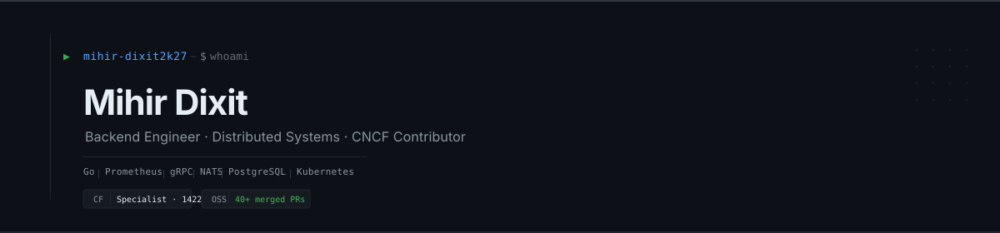

  

 

Final year CS at VIT Vellore. I write Go, work on distributed systems, and contribute to CNCF projects. Codeforces Specialist (1422).

> 40+ merged pull requests across 7 CNCF projects, as a final year undergrad.

 

**currently building**

- [OpenFlow](https://github.com/mihir-dixit2k27/openflow) - distributed workflow automation platform
- [Hotreload](https://github.com/mihir-dixit2k27/hotreload) - Go CLI with live reload and crash detection

                 Sleeping
                 ████████████████████........  27.38 %
                 Coffee
                 ██████████████████..........  25.00 %
                 Debugging
                 ███████████████.............  15.48 %
                 Building
                 ██████████████..............  14.29 %
                 Open Source
                 █████████.................  09.52 %
                 Learning
                 █████.....................  04.76 %
                 Pondering
                 ███.......................  03.57 %

 

**open source**

[Prometheus](https://github.com/prometheus/prometheus) · [Alertmanager](https://github.com/prometheus/alertmanager) · [Grafana Loki](https://github.com/grafana/loki) · [OpenTelemetry](https://github.com/open-telemetry/opentelemetry-go) · [LitmusChaos](https://github.com/litmuschaos/litmus) · [kgateway](https://github.com/kgateway-dev/kgateway) · [PipeCD](https://github.com/pipe-cd/pipecd)

 

  

 

  
  &nbsp;
  

